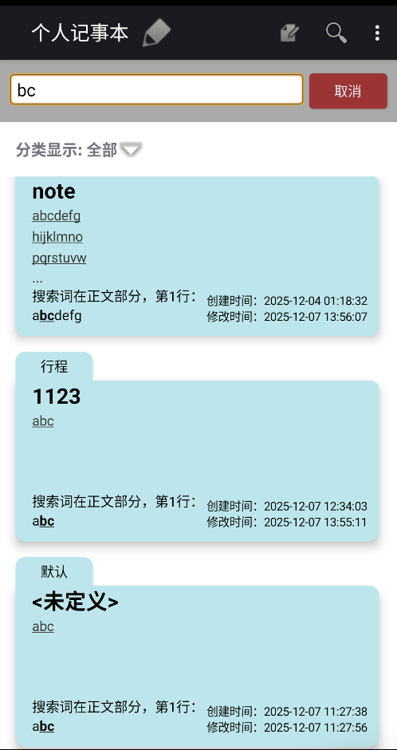
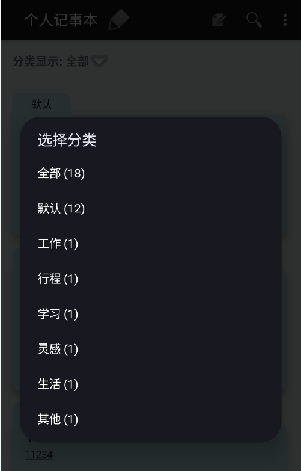
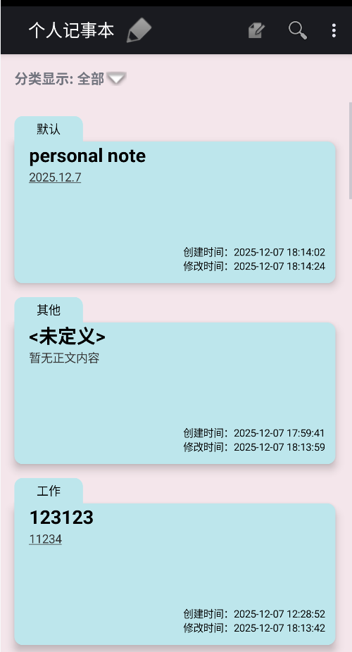
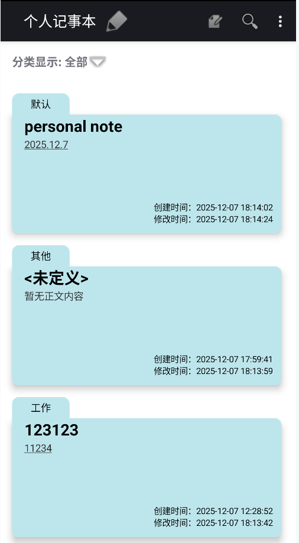
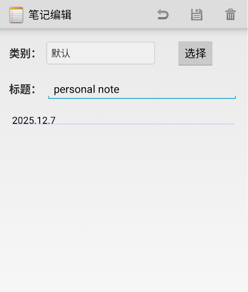
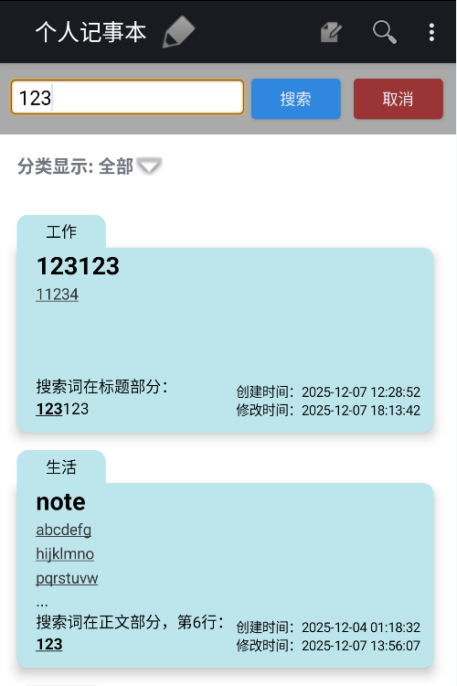
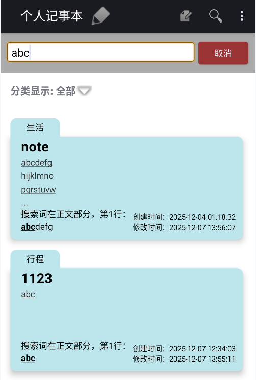
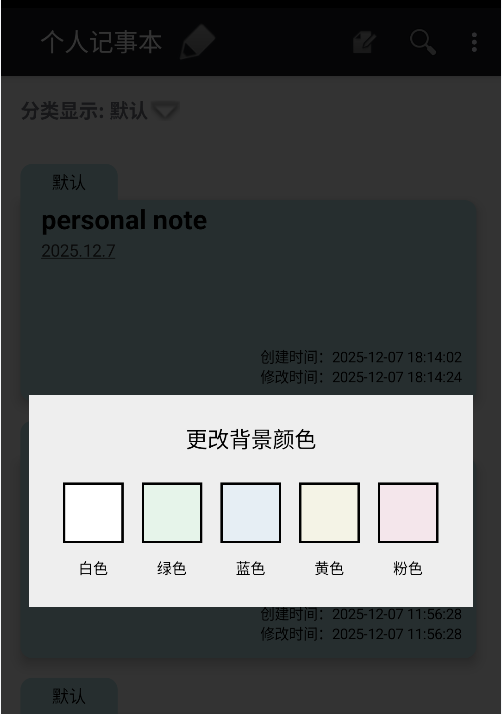

# NotePad 记事本应用

## 项目概述

NotePad是一个基于Android平台的记事本应用，源自官方早期数据库操作基础教程，主要演示Android中ContentProvider与SQLite数据库的交互逻辑。本应用在原始版本基础上进行了功能扩展和UI优化，提供了更完善的笔记管理体验，包括笔记的创建、编辑、查看、分类、搜索等功能。

## 功能介绍

### 核心功能

1. **笔记管理**
   - 创建新笔记
   - 编辑现有笔记
   - 查看笔记内容
   - 删除笔记
   - 从剪贴板粘贴内容创建笔记

2. **笔记列表展示**
   - 以卡片形式展示所有笔记
   - 每条笔记显示标题、部分正文内容
   - 右下角显示创建时间和修改时间(笔记条目的时间戳显示)

### 扩展功能

1. **笔记搜索**
   - 支持按标题或内容搜索笔记
   - 提供两种搜索模式：
     - 实时搜索：输入内容时实时更新搜索结果
     - 点击搜索：输入完成后点击搜索按钮才更新结果
   - 搜索结果中高亮显示匹配的关键词
   - 显示搜索词所在位置及上下文

    

2. **笔记分类**
   - 支持为笔记设置分类
   - 分类列表显示各类别笔记数量
   - 可按分类筛选显示笔记
   - 搜索功能与分类筛选联动（仅在当前分类中搜索）

    
    
    

4. **UI美化**
   - 笔记条目卡片化设计
   - 支持更换应用背景色
   - 编辑器界面优化，区分标题和正文输入区域
   - 新增返回功能，避免误操作

    
    

## 技术实现

### 数据存储与访问

- 采用SQLite数据库存储笔记数据
- 通过ContentProvider封装数据访问接口
- 定义NotePad契约类规范数据交互格式
- 支持数据库版本升级（新增分类字段）

核心数据结构：
```java
// 笔记表结构
public static final class Notes implements BaseColumns {
    public static final String TABLE_NAME = "notes";
    public static final String COLUMN_NAME_TITLE = "title";       // 标题
    public static final String COLUMN_NAME_NOTE = "note";         // 内容
    public static final String COLUMN_NAME_CREATE_DATE = "created"; // 创建时间
    public static final String COLUMN_NAME_MODIFICATION_DATE = "modified"; // 修改时间
    public static final String COLUMN_NAME_CATEGORY = "category"; // 分类
}
```

### 搜索功能实现

- 在NotesList中实现搜索栏和搜索逻辑
- 通过ContentResolver查询匹配的笔记
- 使用SpannableString实现搜索关键词高亮显示
- 支持实时搜索和点击搜索两种模式切换

```java
// 搜索相关代码片段
private void initSearchBar() {
    mSearchBar = findViewById(R.id.search_bar);
    mSearchEditText = findViewById(R.id.search_edit_text);
    mSearchButton = findViewById(R.id.search_button);
    mCancelButton = findViewById(R.id.cancel_button);
    
    // 实时搜索文本监听器
    mSearchTextWatcher = new TextWatcher() {
        @Override
        public void afterTextChanged(Editable s) {
            if (isRealTimeSearch) {
                mSearchQuery = s.toString();
                restartLoader(); // 重新加载数据
            }
        }
        // 其他方法实现...
    };
    mSearchEditText.addTextChangedListener(mSearchTextWatcher);
    
    // 搜索按钮点击事件
    mSearchButton.setOnClickListener(v -> {
        mSearchQuery = mSearchEditText.getText().toString();
        restartLoader();
    });
    
    // 取消按钮点击事件
    mCancelButton.setOnClickListener(v -> {
        mSearchBar.setVisibility(View.GONE);
        mSearchQuery = null;
        restartLoader();
    });
}
```

### 分类功能实现

- 在数据库中添加分类字段
- 实现分类选择对话框
- 在笔记列表顶部添加分类筛选栏
- 实现分类与搜索的联动查询

```java
// 分类相关代码片段
private void initCategoryBar() {
    mCategoryTitle = findViewById(R.id.category_title);
    mCategoryDropdown = findViewById(R.id.category_dropdown);
    mCategoryCounts = new HashMap<>();
    
    // 加载分类数据
    loadCategoryData();
    
    // 分类下拉菜单点击事件
    mCategoryDropdown.setOnClickListener(v -> showCategoryPopup());
    
    // 更新分类显示
    updateCategoryDisplay();
}

private void showCategoryPopup() {
    // 显示分类选择弹窗
    PopupMenu popup = new PopupMenu(this, mCategoryDropdown);
    // 填充分类选项...
    popup.setOnMenuItemClickListener(item -> {
        mSelectedCategory = item.getTitle().toString().split(" ")[0];
        updateCategoryDisplay();
        restartLoader(); // 重新加载数据
        return true;
    });
    popup.show();
}
```

### UI美化实现

1. **笔记条目优化**
   - 使用卡片布局展示笔记
   - 限制标题单行显示，过长内容用省略号
   - 正文内容最多显示三行，超过时显示省略号
   - 右下角显示创建时间和修改时间

2. **背景色更换**
   - 标题栏添加画笔图标按钮
   - 点击弹出颜色选择对话框
   - 保存用户选择的背景色设置

3. **编辑器优化**
   - 分离标题和正文输入区域
   - 工具栏添加返回按钮
   - 返回时放弃未保存的修改

## 使用说明

1. **创建笔记**
   - 在笔记列表页点击右上角"+"按钮
   - 输入标题和正文内容
   - 选择笔记分类
   - 点击返回键自动保存笔记

2. **编辑笔记**
   - 点击列表中的笔记条目进入编辑页
   - 修改内容后点击返回键保存
   - 点击工具栏"返回"按钮放弃修改

3. **搜索笔记**
   - 点击工具栏搜索图标
   - 输入搜索关键词
   - 选择实时搜索或点击搜索按钮
   - 点击取消按钮关闭搜索

4. **分类管理**
   - 点击列表顶部"分类显示"区域
   - 选择要查看的分类
   - 系统会只显示该分类下的笔记

5. **更换背景色**
   - 点击标题栏右侧画笔图标
   - 在弹出的颜色选择框中选择颜色
   - 应用背景会立即更新为所选颜色

## 项目结构

```
app/
├── src/
│   ├── main/
│   │   ├── java/com/example/android/notepad/
│   │   │   ├── NotePad.java           // 数据契约类
│   │   │   ├── NotePadProvider.java   // 内容提供者
│   │   │   ├── NotesList.java         // 笔记列表界面
│   │   │   ├── NoteEditor.java        // 笔记编辑界面
│   │   │   └── NotesLiveFolder.java   // 实时文件夹支持
│   │   └── res/                       // 资源文件
│   └── androidTest/                   // 测试代码
└── build.gradle                       // 构建配置
```

## 截图展示

1. 笔记列表页（带分类和搜索）

  

2. 笔记编辑页

  

3. 搜索功能展示

  
  


4. 分类选择界面

  
  


5. 背景色设置界面

  

## 参考资料

- [Android Sample--NotePad解析](https://blog.csdn.net/llfjfz/article/details/67638499)
- [Android官方开发文档](https://developer.android.google.cn/)
- [SQLite数据库操作指南](https://developer.android.google.cn/training/data-storage/sqlite)
